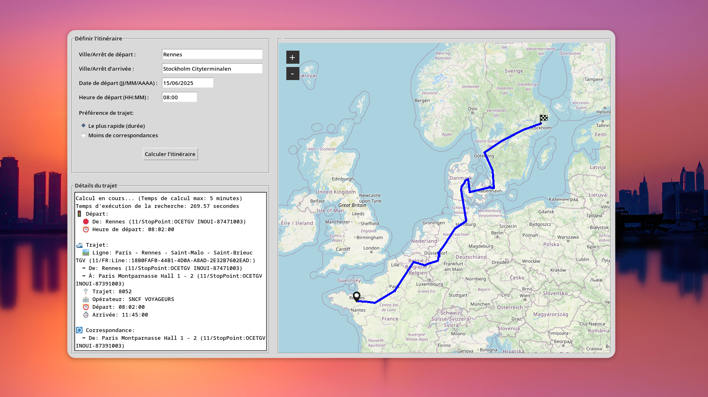

# RailFinder

<p align="center">
  
</p>

A simple rail (and other public transport) trip calculator.


Built using Python and Tkinter.

Group ISN (Informatique et Société Numérique) project at INSA Lyon, France. (2nd year)

### Features
- Journey planning using GTFS data.
- Supports multiple transport modes (train, bus, tram), whatever is available in the GTFS data.
- A* algorithm for route finding, with a heuristic based on distance to destination.
- Automatic database updates from GTFS sources.
- SQLite database for storing GTFS data.
- Cross-network transfers generation, allowing seamless journey planning across different transport modes.
- Visual interface built with Tkinter, with pathfinding visualization.


### Installation
1. Clone the repository:
```bash
git clone https://github.com/Clemorange22/RailFinder.git
cd RailFinder
```

2. Set up a virtual environment:
```bash
python -m venv venv
source venv/bin/activate  # On Windows use `venv\Scripts\activate`
```

3. Install the required dependencies:
```bash
pip install -r requirements.txt
```

### Usage
To run the application:
```bash
python main.py
```

**Note:** Running the application will download GTFS data from the sources specified in `gtfs_sources.json` and store it in `railfinder.db`. Ensure you have:
- Approximately 40GB of free disk space.
- A stable internet connection.

Downloading GTFS data can take some time (~15-20 minutes depending on your internet speed and the number of sources).

The database updates automatically if it is older than 24 hours. To reset the database, delete the `railfinder.db` file.

If you prefer using a precomputed database, name it `railfinder_static.db` and place it in the same directory as `main.py`. The application will then use the static database without downloading GTFS data.


### Journey Planning
The application allows you to plan journeys by entering the departure and arrival stations. It will calculate the best route based on the available GTFS data.

The planner uses an A* algorithm to find the fastest route, considering the available public transport options.
The heuristic is based on the remaining distance to the destination, and assumes a constant speed of 100 km/h for all transport modes. This is a simplification and may not reflect real-world conditions, but it provides a good starting point for journey planning across different transport modes.
Progressive penalties are applied to the route based on the number of ride and transfers.

### Database Management and GTFS Data
The application uses SQLite for the database. It automatically imports GTFS data from the sources defined in `data_sources.json` and stores it in `railfinder.db`.

Sqlite indexes are created for the table columns that are frequently queried, such as `stop_id`, `route_id`, and `trip_id`. This improves the performance of the application when searching for routes and stops, and speeds up the journey planning process, but requires additional disk space.

Finally, to ensure compatibility between different transportation networks, RailFinder automatically detects nearby stops from different networks and adds transfers between them. This allows for seamless journey planning across different transport modes, such as trains, buses, and trams.


### Data Sources

#### France-specific Data
The application supports journey planning using GTFS data for various transport networks in France:

- **Intercités**
- **TER**
- **TGV**
- **Paris (IDFM)**
- **Eurostar**
- **Renfe France**
- **BlaBlaCar Bus**
- **Trenitalia France**

These are fetched from the official GTFS sources at https://transport.data.gouv.fr/

#### Other Countries and Aggregates
Additionally, GTFS data is available for the following countries and services:

- Netherlands
- Switzerland
- Lithuania
- Luxembourg
- Norway
- Sweden
- Germany
- Estonia
- Denmark
- FlixBus

Thanks to https://eu.data.public-transport.earth for providing a comprehensive GTFS data sources list for european countries and services.

### Modularity
The application is organized so that the application logic is separated from the visual interface. 

#### Application logic
All the core functionnalities, like the route calculation, the journey planning, but also the database management and the import of GTFS data are implemented and sorted in different Python files. 

The main entry point of the application is `main.py`. It initializes the database and the journey planner, then launches the graphical user interface. This file connects all the core components and starts the RailFinder application.

The core functionnalities are divided in three main files named after the class they contain:
  - **`JourneyPlanner`**: a class that handles the journey search, with a A* Algorithm and heuristics to calculate and find the optimised journey
  - **`Database`**: a class that manages SQLite database operations, GTFS data import and metadata to allow access to the european transportation network, necessary to run the application
  - **`TransferGenerator`**: a class that automatically creates transfers between nearby stops across networks.


Two additional files complete the application logic:
- **`utils.py`**: contains helper functions for calculations and data processing
- **`models.py`**: defines the main structures used in the application, mainly the classes representing all the stops, their positions, transfers, time etc.

#### Visual Interface
The user interface is built using Tkinter in the class named `RoutePlannerApp` (contained in the dedicated file `interface.py`).

The interface is here mainly to:
- Handle user input (departure, arrival, journey steps, date and preferred time and options)
- Display the map with the itinerary and the journey results

This separation ensures that the application logic can be tested and maintained independently of the user interface, and makes it easier to adapt and modify the project.

